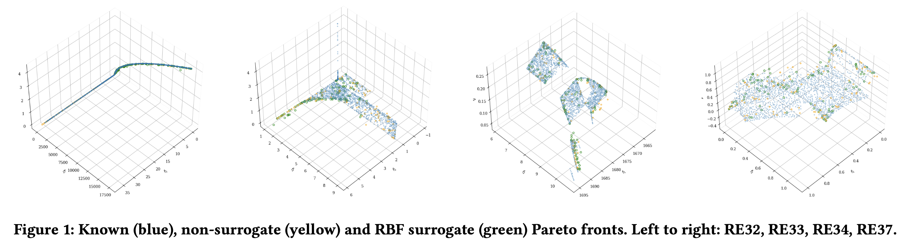

# Adaptive Evolution Control For Radial Basis Function Surrogates
For Multi-Objective Optimisation Problems with expensive fitness functions, surrogate models may be designed in order to reduce the evaluation cost of multi objective evolutionary algorithms. This code trains a Radial Basis Function surrogate and applies it to the NSGA-II
algorithm. An adaptive surrogate training strategy is proposed and implemented,
based on the incremental error observed between model predic-
tions and true function evaluations, and I evaluated this on a suite of
real-world problems.

An accompanying short paper has been written, which is available upon request!

## Requirements

This project build upon the Pymoo library, which is required to run the project [Pymoo Link](https://pymoo.org).

The tests used for evaluation are the ones discussed in [1], which can be found on the GitHub page linked here: [Test problem link](https://github.com/ryojitanabe/reproblems).
The following files from the test problem repo are required for metric_experiments.py and problem_wrapper.py:

 - ``approximated_Pareto_fronts``
 - ``reproblem.py`` (Python Version)

## Results

Across multiple problems, a much higher performance in indicator value for a small increase in evaluations is achieved. The 'None' points refer to fixed evolution control, to compare with the proposed algorithm.

Figure 2 shows all the averaged trials for two problems, RE24 and
RE33. I plot the reciprocal of GD+, meaning the best metric values are
those with higher y-axis values. I suggest that it is important to
consider both the best metric rate, i.e. GD+ value for a given number
of evaluations, and also the best GD+ value achieved overall. So
the dashed lines in each colour averages between the best rate
gradient and vector from the origin to the best GD+ value.

Adaptive Evolution Control Algorithm proposed and implemented by Lucia Adams

[1] Ryoji Tanabe and Hisao Ishibuchi. 2020. An Easy-to-use Real-world Multi-objective Optimization Problem Suite. https://doi.org/10.48550/arXiv.2009.12867
arXiv:2009.12867.

